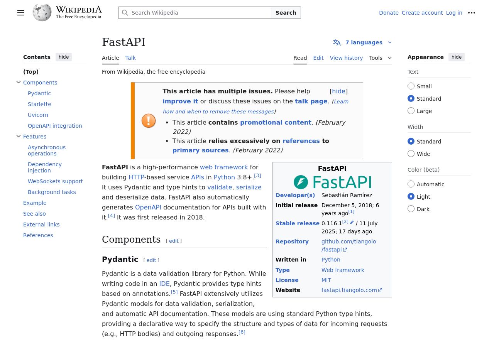

# AI Workflow Creator

AI-powered workflow automation engine that **translates human instructions into executable, headless browser workflows** — run in parallel, monitored in real-time, and designed for production-grade reliability.

---

## 🚀 Overview

This project allows you to define **browser automation flows** in plain language, which are then:
1. Interpreted by OpenAI’s GPT model into actionable Playwright steps.
2. Executed asynchronously by Celery workers via RabbitMQ.
3. Monitored live in Flower, with full metrics in Grafana.
4. Stored (screenshots, logs, states) in a shared volume or database for easy retrieval.

**Applicable for:**
- QA and regression testing
- Data scraping and form submission
- No-code automation platforms
- AI agent execution backends
- Any recurring, complex browser interaction

---

## 🛠️ Technology Stack

| Component             | Technology                                |
| --------------------- | ----------------------------------------- |
| Web Framework         | FastAPI                                   |
| Task Queue            | Celery                                    |
| Broker                | RabbitMQ                                  |
| Result Backend        | MongoDB                                   |
| Browser Automation    | Playwright, Playwright Stealth            |
| Containerization      | Docker & Docker Compose                   |
| AI Workflow Parsing   | OpenAI GPT-3.5 Turbo                      |
| Logging & Metrics     | Grafana + Prometheus                      |
| Task Monitoring       | Flower UI                                 |

---

## 🏗️ High-Level Architecture

                                        +------------------+
                                        |   Client (User)  |
                                        +--------+---------+
                                                 |
                                                 v
                                        +--------+---------+
                                        |                  |                +--------------+
                                        |                  +<-------------->|    OpenAI    |
                                        |  FastAPI Server  |                +--------------+
                                        |                  +------------------------------------+
                                        |                  |                                    |
                                        +--------+---------+                                    |
                                                 |                                              |
                                                 v                                              |
                                        +--------+---------+                                    |
                                        |    RabbitMQ      |                                    |
                                        +--------+---------+                                    |
                                                 |                                              |
                       +-------------------------+------------------------------+               |
                       |                                                        |               |
                       v                                                        v               |
            +----------+----------+                                    +--------+---------+     |
            |  Celery Worker      |  <----------------------------->   |  Celery Results  |     |
            | (Executes Workflow  |        ( Results, Workflow Logs    |  Backend + Logs  |     |
            |    & Automation)    |               & State )            |     (MongoDB)    |     |
            |                     |                                    +------------------+     |
            |                     |-------------------+                                         |
            +---------------------+                   |                                         |
                        |                             |                                         v
                        v                             |                            +------------+------------+
            +-----------+-------------+               +--------------------------->+  Shared Storage Volume  |
            | Browser Automation Task |                                            +-------------------------+
            |  (Playwright Headless)  |
            +-------------------------+

            +-------------------+  +------------------------+
            |     Flower UI     |  |  Grafana + Prometheus  |
            | (Task Monitoring) |  |   (Metrics dashboard)  |
            +-------------------+  +------------------------+


---

## 💡 Key Design Decisions

- **RabbitMQ over Redis:** Better fault tolerance, and message delivery guarantees
- **MongoDB for Results:** Flexible schema support and is persistent, used for application state. 
- **Storage layer Abstraction:** Enables local shared volume now, but can easily swap in S3 or GCS later with change in one place.
- **Playwright for Browser Automation:** Modern, powerful, with ability to simulate real browsers (headers, UA, etc.) to reduce detection. More flexible than BeautifulSoup / Selenium
- **Full Observability:** Metrics (Prometheus/Grafana) + Task Monitoring (Flower) = fast debugging and scaling confidence.
- **Microservice Architecture:** Fully dockerized and scalable.

---


## ⚡ Quick Start

### 1. Clone & Configure
```bash
git clone https://github.com/salmandotexe/ai-workflow-creator.git
cd ai-workflow-creator
cp .env.example .env
# Add your OPENAI_API_KEY and any other variables
```

### 2. Run with Docker
```bash
docker-compose up --build
```

---

## 📌 Example Usage

### 1. Generate a Workflow
POST `/api/v1/generate-workflow/`

```json
{
    "instruction": "Go to en.wikipedia.org, type in FastAPI, click search, wait 1 second, take a screenshot"
}
```

**Sample Response**

```json
{
    "task_id": "1e80eebf-da7d-408d-8c1a-b456ec98868d",
    "workflow": [
        {
            "action": "goto",
            "url": "https://en.wikipedia.org"
        },
        {
            "action": "type",
            "selector": "#searchInput",
            "value": "FastAPI"
        },
        {
            "action": "click",
            "selector": ".cdx-button.cdx-button--action-default.cdx-button--weight-normal.cdx-button--size-medium.cdx-button--framed.cdx-search-input__end-button"
        },
        {
            "action": "wait",
            "value": 1
        },
        {
            "action": "screenshot"
        }
    ]
}
```
### 2. Run a Workflow
POST `/api/v1/run-workflow/`

**Sample Response**

```json
{
    "steps": [
        { "action": "goto",  "url": "https://en.wikipedia.org" },
        { "action": "type", "selector": "#searchInput", "value": "FastAPI"},
        {
            "action": "click",
            "selector": ".cdx-button.cdx-button--action-default.cdx-button--weight-normal.cdx-button--size-medium.cdx-button--framed.cdx-search-input__end-button"
        },
        { "action": "wait", "value": 1 },
        { "action": "screenshot" }
    ]
}
```

**Result: Screenshot stored in /shared/screenshots (or S3, if configured).**




---

## 📊 Monitoring & Metrics
- **Flower UI:** http://localhost:5555 – Live Celery task state

- **Grafana:** http://localhost:3000 – Metrics dashboards (via Prometheus)

- **Prometheus:** Scrapes FastAPI & Celery metrics

--- 

## 🤝 Contributing
This project is open-source and welcomes contributions of all sizes — from fixing typos to architecting new modules. Here are some potential areas to contribute:

- **Frontend:**
    - The UI is currently minimal and could use a polished, interactive frontend for a better user experience.

    - Build a dashboard to browse and view screenshots directly from the web app.

- **Prompt Engineering:**

    - Current AI prompt logic is basic — help make it smarter, contextual, and better at adapting to different tasks. It's an easy way to contribute to open source.

    - Integrate **LangChain** (or similar) so the system can dynamically fetch and process website HTML for more accurate results.

- **Storage & Media Handling:**

    - Implement optional cloud storage backends (S3, GCS, etc.) in the StorageService wrapper for production scalability.

- **Monitoring & Observability:**

    - Extend the Grafana dashboards with richer metrics and alerts.

    - Enhance Flower UI integration for better task tracking.

- **Workflow Enhancements:**

    - Add support for parallel AI tasks or branching workflows.

    - Implement retry/backoff logic for more resilient automation.

- **Testing & CI/CD:**

    - Expand the test coverage for all services.

    - Add a GitHub Actions workflow for automated testing and deployment.

    - Add a DEBUG flag, when set to true, mock the LLM responses so it can be run without an API key

If you’ve got ideas outside this list — go for it. PRs are welcome!


---

## 📜 License
Go wild. Use this for personal projects, enterprise apps, commercial SaaS, or the next unicorn startup — no strings attached, no attribution required.

Fork it. Break it. Make it better. Ship it.

**If you find it useful (or just cool), dropping a ⭐ on the repo would mean the world.**
